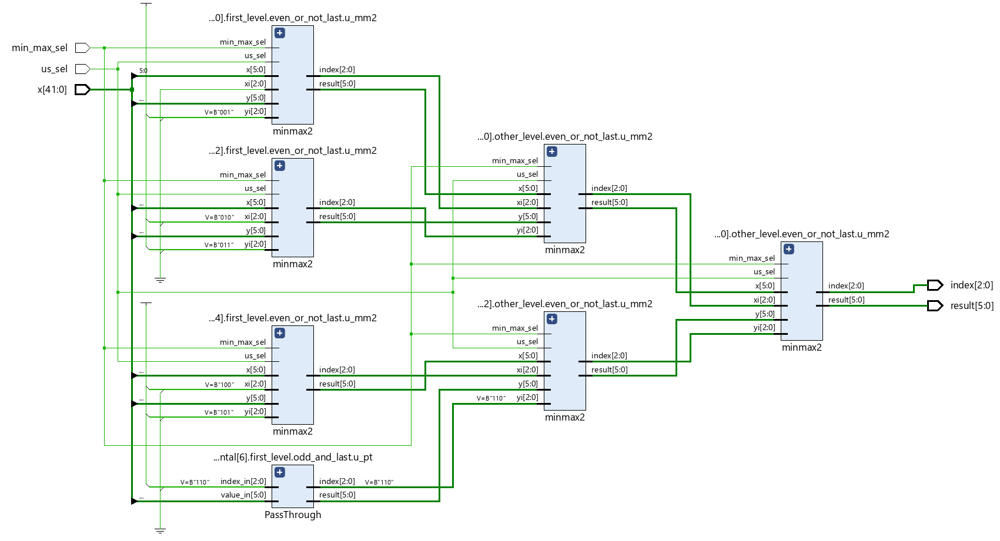
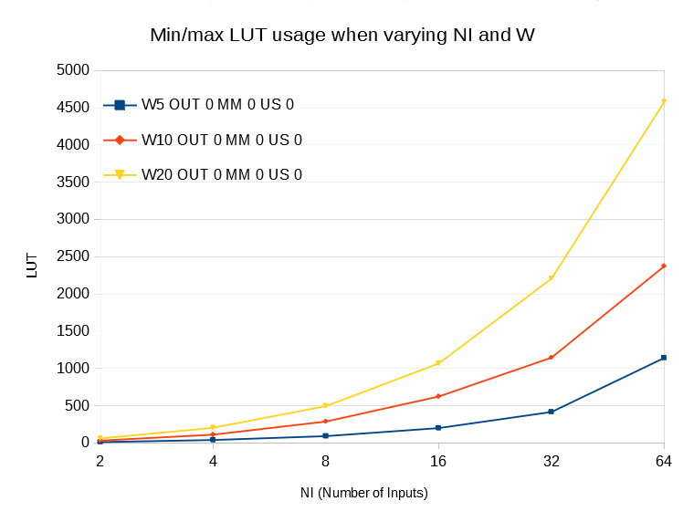

### Min/Max synthesizable module in SystemVerilog for unsigned values ###

Use parameters W and NI to respectively define the size of each value and the number of input.

Set `min_max_sel` to either 0 or 1 to select respectively search of minimum or maximum

Notice that if you have two or more maximum/minimum values, the one with the smallest index is output.

Parameters description:
- OUT_CFG can be set to 0, which will output both value and index, or 1 where only value is output;
- MM_CFG can be set to 0 which supports both computing min and max, 1 only min, 2 only max;

Following, the LUT usage when varying number of inputs (NI) and data size (W).

To use UVM with ModelSim:
- download uvm 1.2
- compile with: `path_to/uvm-1.2/src/uvm_pkg.sv +incdir+path_to/uvm-1.2/src +define+UVM_NO_DPI +define+UVM_NO_RELNOTES +define+UVM_NO_DEPRECATED +define+UVM_OBJECT_DO_NOT_NEED_CONSTRUCTOR`
