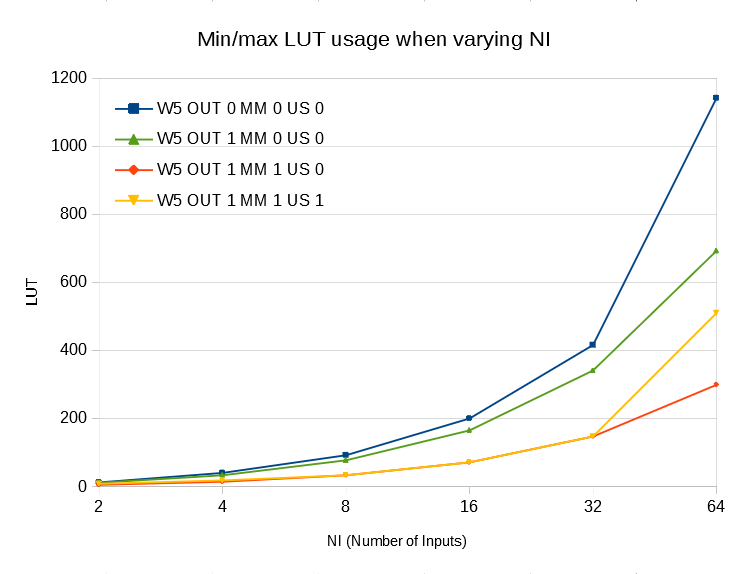

### Min/Max synthesizable module in SystemVerilog for both signed and unsigned values ###

Use parameters W and NI to respectively define the size of each value and the number of input.
For example, to provide input for a W=6 and NI=4 case do as follows:

    //    3      2      1      0
    x = {6'd4, 6'd43, 6'd22, 6'd61}

1. set `us_sel` to either 0 or 1 to respectively select unsigned or signed computation
2. set `min_max_sel` to either 0 or 1 to select respectively search of minimum or maximum

To provide signed input do as follows:

    //    3      2      1      0
    x = {-6'd4, 6'd0, -6'd22, 6'd30}

Notice that if you have two or more maximum/minimum values, the one with the smallest index is output.

Parameters description:
- OUT_CFG can be set to 0, which will output both value and index, or 1 where only value is output;
- MM_CFG can be set to 0 which supports both computing min and max, 1 only min, 2 only max;
- US_CFG can be set to 0 which supports both signed and unsigned computing, 1 only unisgned, 2 only signed.

Following, the LUT usage when varying number of inputs (NI) and data size (W).

Next chart shows LUT resource usage when varying configurations.
Strangely, when only signed or unsigned is used, no further resource is saved, rather more are used for NI=64.

